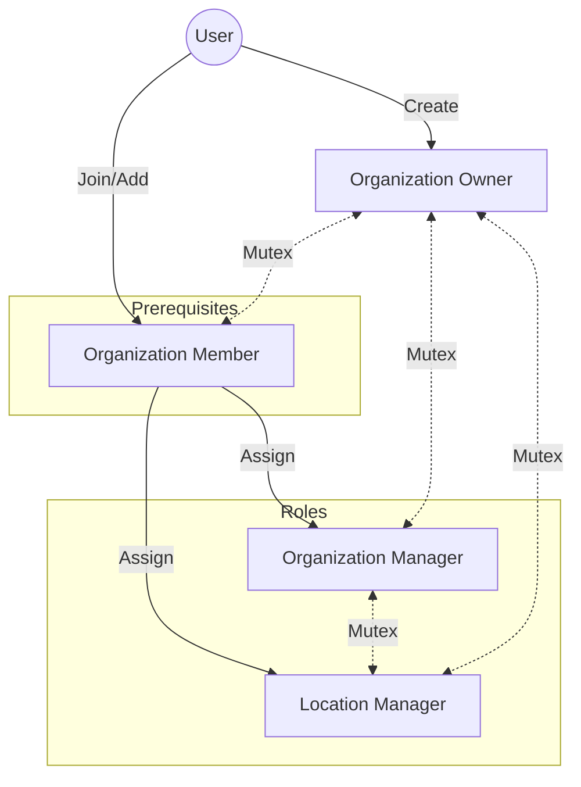

# 角色與權限系統 (Role & Permission System)

這份文件描述了一個**階層式**的權限管理系統（RBAC），主要將權限分為「全域系統」、「組織（總部）」與「特定場館」三個層次：

1. **系統管理員 (System Admin)**：擁有神的視角，可管理所有組織與設定。
2. **組織層級 (Organization Level)**：包含「擁有者」與「組織管理員 (Organization Manager)」。他們管理整個組織的營運，例如新增場館、管理員工。權限上兩者幾乎相同，但擁有者每個組織只能有一位。
3. **場館層級 (Location Level)**：即「場館管理員 (Location Manager)」。權限被限制在**特定場館**內，只能管理該場館的球場資源與預約狀況，無法觸及組織設定或刪除場館。

**關鍵邏輯**：系統在設計資料庫時，將「組織權限」與「場域權限」分開儲存（解耦）。這意味著一個人可以只當某個場域的管理員，而不需要是該組織的高層成員。

## 角色 (Roles)

本系統建立在 **組織 (Organizations)** 的概念之上。使用者隸屬於具有特定角色的組織。

### 1. 系統管理員 (System Admin) - 全域

**識別方式：** 在 `users` 表中 `is_system_admin = true`。

- **範圍：** 整個系統。
- **權限：** 對所有組織、使用者、場域和系統設定擁有完全存取權。
- **管理：** 可以建立組織並指派初始擁有者。

### 2. 組織擁有者 (Organization Owner)

**識別方式：** 在 `organizations` 表中 `owner_id` 欄位。

- **數量：** 每個組織限制 **一位**。
- **範圍：** 他們所擁有的特定組織。
- **權限：**
  - 對組織內的所有資源擁有 **完全存取權 (Full access)**。
  - 可以管理組織設定（名稱、啟用狀態）。
  - 可以管理組織成員（管理員）。
  - 可以建立、更新和刪除場域 (Locations)。
  - 可以指派/取消指派場地管理員。

### 3. 組織成員 (Organization Member)

**識別方式：** 存在於 `organization_members` 資料表中。

- **範圍：** 特定組織。
- **角色定位：**
  - 這是組織內的基礎身分。
  - 所有 Manager / Location Manager 都必須由此身分晉升。
  - 僅具備基本的讀取權限 (視具體實作而定)，主要是作為身分綁定的基礎。

### 4. 組織管理員 (Organization Manager)

**識別方式：** 存在於 `organization_managers` 資料表中。

- **前置條件：** 必須先是 **Organization Member**。
- **數量：** 允許由多位擔任。
- **範圍：** 特定的組織。
- **權限：**
  - 在能力上 **等同於擁有者**。
  - 可以管理組織設定。
  - 可以管理場館（建立/更新/刪除）。
  - 可以管理場館管理員 (Location Managers)。

### 5. 場館管理員 (Location Manager)

**識別方式：** 存在於 `location_managers` 資料表中。

- **前置條件：** 必須先是 **Organization Member**。
- **數量：** 允許由多位擔任。
- **範圍：** 僅限 **特定場館**。
- **權限：**
  - **無權存取** 組織設定。
  - **無權** 操作場館本身（不能建立/刪除場館）。
  - **可以管理** 指派場館內的資源（球場/房間）。
  - **可以管理** 指派場館內的預約。
- **角色互斥：**
  - 若使用者已是 **Organization Manager** 或 **Owner**，則**不能**擔任場館管理員。
  - 系統內的高階管理職與場館專屬職責是分開的。

## 權限授與流程 (Permission Granting Flow)

## 權限邏輯 (Permission Logic)

存取控制是在服務層 (Service layer) 和 HTTP 處理層 (Handler layer) 強制執行的。

### 系統層級檢查

- **`IsSystemAdmin`：** 透過使用者標記 (flag) 進行檢查。此權限凌駕於所有其他檢查之上。

### 組織層級檢查

- **`IsManagerOrAbove(orgID, userID)` (完全存取權)：**
- 若使用者是系統管理員，回傳 `true`。
- 若使用者是組織的 **Owner** (檢查 `organizations.owner_id`) 或存在於 `organization_managers` 表，回傳 `true`。
- 授予權限：更新組織、建立/刪除場館、管理員工。

### 場館層級檢查

- **`IsLocationManagerOrAbove(locationID, userID)`：**
- 若使用者通過 `IsManagerOrAbove`（系統管理員 / 擁有者 / 組織管理員），回傳 `true`。
- 若使用者在特定 `locationID` 的 `location_managers` 清單中，回傳 `true`。
- 授予權限：更新場館詳細資訊、管理資源、管理預約。

## 用於權限管理的 API 端點

### 組織員工 (擁有者 & 組織管理員)

- `POST /v1/organizations/:id/managers`：新增一位使用者為管理員 (Manager)。
  - **注意**：使用者必須先存在於成員列表 (Members) 中。
  - 請求資料 (Payload)：`{"user_id": "uuid"}`
- `DELETE /v1/organizations/:id/managers/:user_id`：移除一位管理員。

### 組織成員 (一般成員)

- `POST /v1/organizations/:id/members`：加入新成員。
- `GET /v1/organizations/:id/members`：查看成員列表。
- `DELETE /v1/organizations/:id/members/:user_id`：移除成員 (會連帶移除所有管理職)。

### 場館員工 (場館管理員)

- `POST /v1/locations/:id/managers`：指派一位使用者為特定場館的管理員。
  - 請求資料 (Payload)：`{"user_id": "uuid"}`
  - 存取控制：僅限組織擁有者/組織管理員。
- `GET /v1/locations/:id/managers`：列出某個場域的所有管理員。

## 資料庫架構模型 (Database Schema Model)

- **`organizations`** (Owner 欄位)：
  - `owner_id` 欄位定義了組織擁有者。每個組織僅有一位擁有者。
- **`organization_managers`**：
  - 將 `user_id` 連結至 `organization_id`，定義組織管理員。
  - **目的：** 授予高層級的組織控制權 (除擁有者專屬權限外)。
- **`location_managers`**：
  - 將 `user_id` 連結至 `location_id`。
  - **限制 (Constraint)：** 指向 `users` 和 `locations` 的外鍵 (Foreign keys)。
  - **目的：** 授予特定場域的存取權。
  - **解耦 (Decoupling)：** 此資料表獨立於 `organization_managers`。
