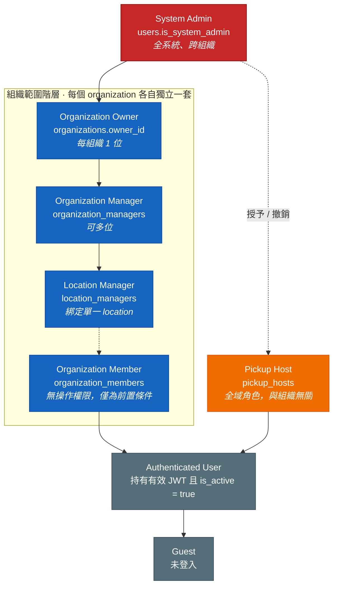
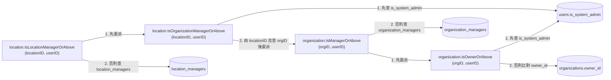
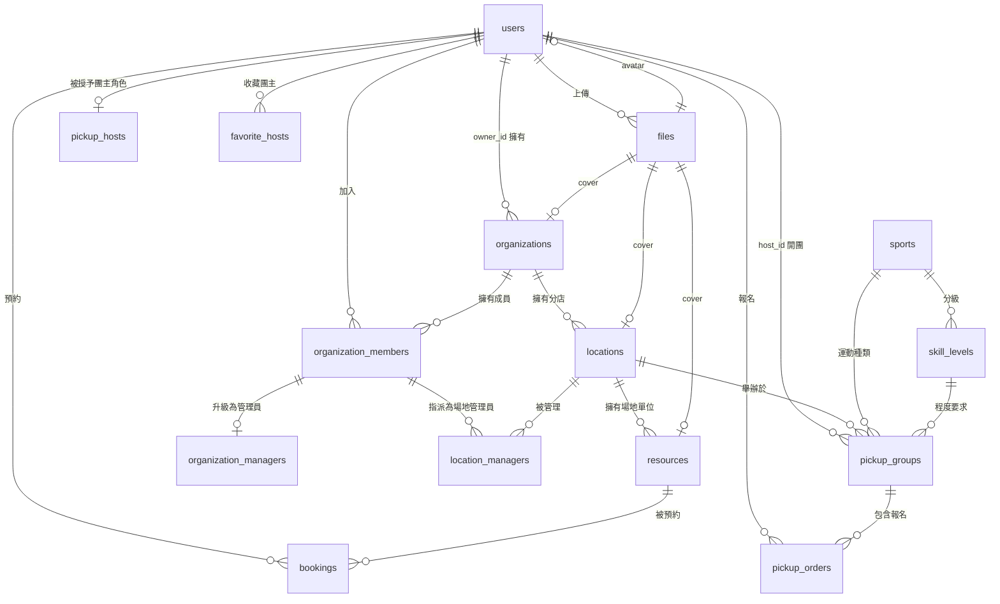
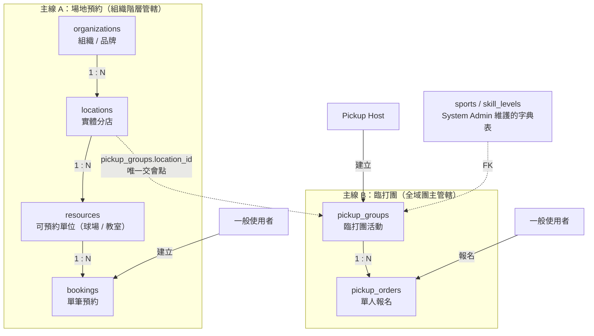
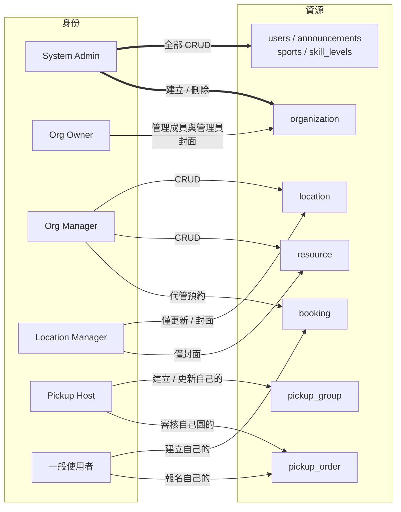
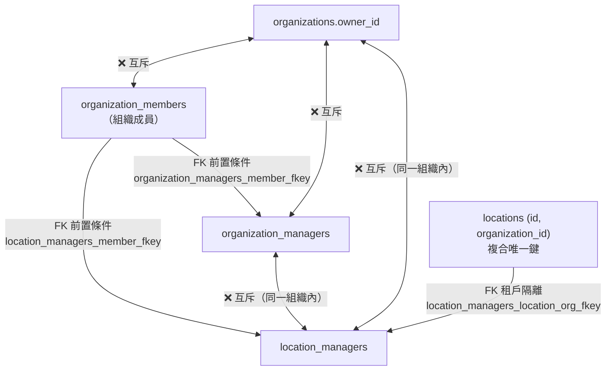
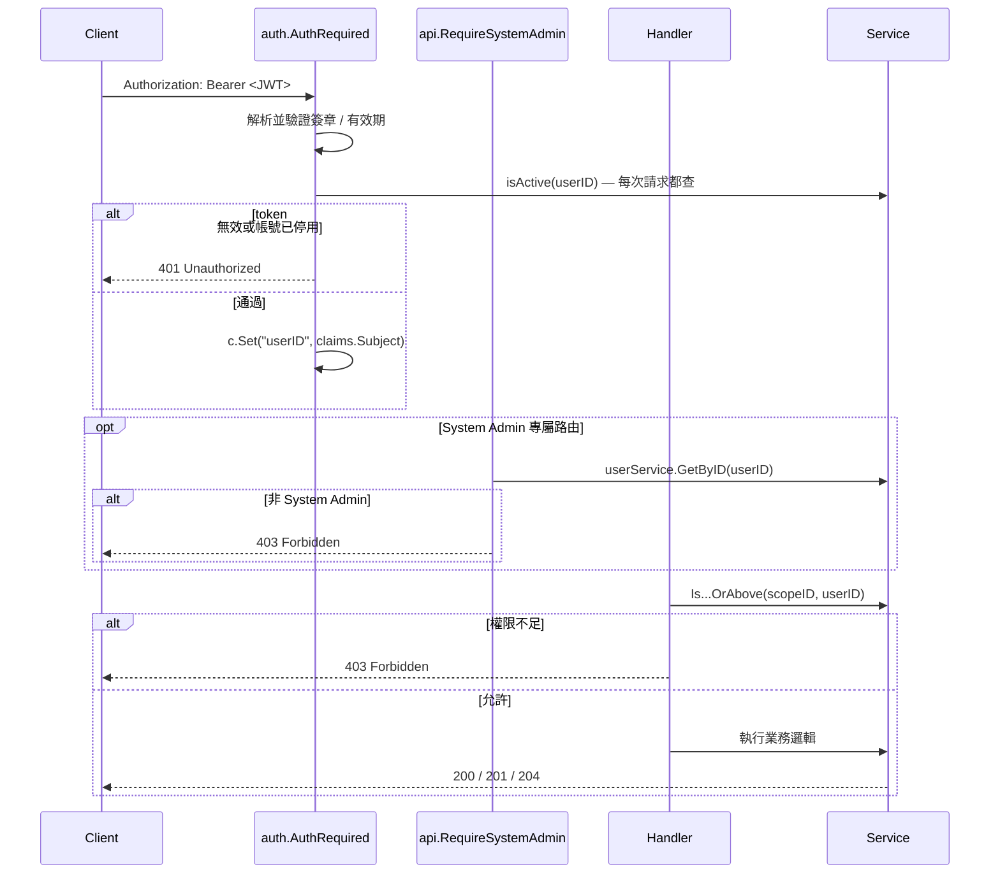

# 身份組系統架構說明

本文件說明「場地預約系統後端」的身份（identity）、角色（role）與權限（permission）架構，以及各種資源（組織、場地、資源、預約、臨打團）之間的從屬與互動關係。

內容依據 `db/migrations/` 的資料表定義，以及 `internal/*/http/route.go`、`internal/*/http/handler.go`、`internal/*/service.go`、`internal/api/middleware.go`、`internal/auth/middleware.go` 的實際程式碼整理而成。

---

## 1. 核心設計：沒有 `role` 欄位

本系統**沒有**單一的 `users.role` 欄位，也沒有 RBAC 的 `roles` / `permissions` 表。一個使用者的「身份」是在每次請求時，由以下三類來源**動態推導**出來的：

| 類別 | 來源 | 作用範圍 |
| --- | --- | --- |
| **全域旗標** | `users.is_system_admin`（布林欄位） `pickup_hosts`（有無該 user_id 的資料列） | 跨租戶，全系統生效 |
| **組織範圍成員表** | `organizations.owner_id` `organization_managers` `organization_members` `location_managers` | 只在特定 organization / location 內生效 |
| **資料列擁有權** | `bookings.user_id` `pickup_groups.host_id` `pickup_orders.user_id` `files.user_id` `favorite_hosts.user_id` | 只對「自己的那一筆資料」生效 |

這代表**同一個使用者在不同組織下可以有不同身份**：他可能是 A 組織的 Owner、B 組織的一般成員、C 組織的場地管理員，同時又是全域的臨打團主。

---

## 2. 角色一覽

### 2.1 全域角色（跨組織）

| 角色 | 判定依據 | 授予方式 |
| --- | --- | --- |
| **System Admin（系統管理員）** | `users.is_system_admin = true` | 由既有 System Admin 透過 `PATCH /v1/users/:id` 設定；系統初始化時以 `set_admin.sh` 腳本直接寫入資料庫（bootstrap） |
| **Pickup Host（臨打團主）** | `pickup_hosts` 表中有該 `user_id` | 僅 System Admin 可透過 `POST /v1/pickup-hosts` 授予、`DELETE /v1/pickup-hosts/:id` 撤銷 |
| **Authenticated User（一般已登入使用者）** | 持有有效 JWT 且 `users.is_active = true` | `POST /v1/auth/register` 自行註冊 |
| **Guest（未登入訪客）** | 無 Authorization header | — |

### 2.2 組織範圍角色（scoped roles）

| 角色 | 判定依據 | 授予者 |
| --- | --- | --- |
| **Organization Owner（組織擁有者）** | `organizations.owner_id = user_id`，每個組織**恰好一位** | System Admin（`PATCH /v1/organizations/:id` 換 owner） |
| **Organization Manager（組織管理員）** | `organization_managers (organization_id, user_id)` 存在 | Organization Owner 或 System Admin |
| **Location Manager（場地管理員）** | `location_managers (location_id, user_id)` 存在 | Organization Manager 以上 |
| **Organization Member（組織成員）** | `organization_members (organization_id, user_id)` 存在 | Organization Owner 或 System Admin |

> **注意**：`organization_members` 本身**不帶任何操作權限**，它純粹是成為 Organization Manager / Location Manager 的**資料庫層級前置條件**（見 §5）。

---

## 3. 權限階層

### 3.1 階層總覽

```mermaid
flowchart TD
    SA["System Admin<br/>users.is_system_admin<br/><i>全系統、跨組織</i>"]

    subgraph ORG ["組織範圍階層 · 每個 organization 各自獨立一套"]
        direction TB
        OWNER["Organization Owner<br/>organizations.owner_id<br/><i>每組織 1 位</i>"]
        OMGR["Organization Manager<br/>organization_managers<br/><i>可多位</i>"]
        LMGR["Location Manager<br/>location_managers<br/><i>綁定單一 location</i>"]
        MEMBER["Organization Member<br/>organization_members<br/><i>無操作權限，僅為前置條件</i>"]
    end

    USER["Authenticated User<br/>持有有效 JWT 且 is_active = true"]
    GUEST["Guest<br/>未登入"]

    HOST["Pickup Host<br/>pickup_hosts<br/><i>全域角色，與組織無關</i>"]

    SA --> OWNER
    OWNER --> OMGR
    OMGR --> LMGR
    LMGR -.-> MEMBER
    MEMBER --> USER
    USER --> GUEST

    SA -.->|授予 / 撤銷| HOST
    HOST --> USER

    classDef admin fill:#c62828,stroke:#8e0000,color:#fff
    classDef org fill:#1565c0,stroke:#0d47a1,color:#fff
    classDef base fill:#546e7a,stroke:#37474f,color:#fff
    classDef host fill:#ef6c00,stroke:#e65100,color:#fff
    class SA admin
    class OWNER,OMGR,LMGR,MEMBER org
    class USER,GUEST base
    class HOST host
```

三個重點：

1. **System Admin 是 god mode**：所有 `Is...OrAbove` 權限檢查的第一步都是先看 `is_system_admin`，為 true 就直接放行，不必是該組織的任何成員。
2. **Pickup Host 是平行的全域角色**，不在組織階層內。他不需要屬於任何組織，也不會因此獲得任何組織/場地的管理權。
3. **Organization Member 不是「低階管理員」**，它沒有比一般使用者多出任何 API 權限（連列出同組織成員都不行——那需要 Manager 以上）。

### 3.2 權限判定函式鏈

程式中的權限判定集中在四個 `Is...OrAbove` 方法，彼此逐層委派：

```mermaid
flowchart LR
    A["location.IsLocationManagerOrAbove<br/>(locationID, userID)"]
    B["location.IsOrganizationManagerOrAbove<br/>(locationID, userID)"]
    C["organization.IsManagerOrAbove<br/>(orgID, userID)"]
    D["organization.IsOwnerOrAbove<br/>(orgID, userID)"]

    A -->|"1. 先委派"| B
    A -->|"2. 否則查 location_managers"| LM[("location_managers")]
    B -->|"1. 先查 is_system_admin"| SA[("users.is_system_admin")]
    B -->|"2. 由 locationID 反查 orgID 後委派"| C
    C -->|"1. 先委派"| D
    C -->|"2. 否則查 organization_managers"| OM[("organization_managers")]
    D -->|"1. 先查 is_system_admin"| SA
    D -->|"2. 否則比對 owner_id"| OW[("organizations.owner_id")]
```

對應原始碼：

- [organization/service.go:338](../internal/organization/service.go#L338) — `IsOwnerOrAbove`
- [organization/service.go:365](../internal/organization/service.go#L365) — `IsManagerOrAbove`
- [location/service.go:345](../internal/location/service.go#L345) — `IsOrganizationManagerOrAbove`
- [location/service.go:369](../internal/location/service.go#L369) — `IsLocationManagerOrAbove`

由於 `location` 的權限方法接受的是 `locationID`，它會先透過 `locations.organization_id` 反查所屬組織，再委派給 `organization` 的方法——這就是「場地權限自動繼承組織權限」的實作方式。

---

## 4. 資源結構與互動關係

### 4.1 資料表關聯（ER 圖）

```mermaid
erDiagram
    users ||--o{ organizations : "owner_id 擁有"
    users ||--o{ organization_members : "加入"
    users ||--o{ bookings : "預約"
    users ||--o{ pickup_groups : "host_id 開團"
    users ||--o{ pickup_orders : "報名"
    users ||--o{ files : "上傳"
    users ||--o| pickup_hosts : "被授予團主角色"
    users ||--o{ favorite_hosts : "收藏團主"

    organizations ||--o{ organization_members : "擁有成員"
    organization_members ||--o| organization_managers : "升級為管理員"
    organization_members ||--o{ location_managers : "指派為場地管理員"

    organizations ||--o{ locations : "擁有分店"
    locations ||--o{ location_managers : "被管理"
    locations ||--o{ resources : "擁有場地單位"
    locations ||--o{ pickup_groups : "舉辦於"
    resources ||--o{ bookings : "被預約"

    pickup_groups ||--o{ pickup_orders : "包含報名"
    sports ||--o{ skill_levels : "分級"
    sports ||--o{ pickup_groups : "運動種類"
    skill_levels ||--o{ pickup_groups : "程度要求"

    files ||--o| users : "avatar"
    files ||--o| organizations : "cover"
    files ||--o| locations : "cover"
    files ||--o| resources : "cover"
```

### 4.2 兩條互相獨立的資源主線

系統的資源分成兩條主線，兩者只在 `locations` 交會：

```mermaid
flowchart TD
    subgraph L1 ["主線 A：場地預約（組織階層管轄）"]
        direction TB
        ORG["organizations<br/>組織 / 品牌"]
        LOC["locations<br/>實體分店"]
        RES["resources<br/>可預約單位（球場 / 教室）"]
        BOOK["bookings<br/>單筆預約"]
        ORG -->|"1 : N"| LOC
        LOC -->|"1 : N"| RES
        RES -->|"1 : N"| BOOK
    end

    subgraph L2 ["主線 B：臨打團（全域團主管轄）"]
        direction TB
        PG["pickup_groups<br/>臨打團活動"]
        PO["pickup_orders<br/>單人報名"]
        PG -->|"1 : N"| PO
    end

    LOC -.->|"pickup_groups.location_id<br/>唯一交會點"| PG

    U1["一般使用者"] -->|"建立"| BOOK
    U2["Pickup Host"] -->|"建立"| PG
    U3["一般使用者"] -->|"報名"| PO

    SPORT["sports / skill_levels<br/>System Admin 維護的字典表"] -.->|"FK"| PG
```

**關鍵設計意涵**：臨打團只透過 `location_id` 外鍵指向場地，但**組織階層對臨打團完全沒有管轄權**。Organization Owner 無法管理在自己場地舉辦的臨打團——只有該團的 Host 與 System Admin 可以（詳見 §7 待確認事項 4）。

### 4.3 角色掛載到資源的位置

```mermaid
flowchart LR
    subgraph ROLES ["身份"]
        SA["System Admin"]
        OW["Org Owner"]
        OM["Org Manager"]
        LM["Location Manager"]
        PH["Pickup Host"]
        NU["一般使用者"]
    end

    subgraph RESOURCES ["資源"]
        ORG["organization"]
        LOC["location"]
        RES["resource"]
        BOOK["booking"]
        PG["pickup_group"]
        PO["pickup_order"]
        SYS["users / announcements<br/>sports / skill_levels"]
    end

    SA ==>|"全部 CRUD"| SYS
    SA ==>|"建立 / 刪除"| ORG
    OW -->|"管理成員與管理員<br/>封面"| ORG
    OM -->|"CRUD"| LOC
    OM -->|"CRUD"| RES
    OM -->|"代管預約"| BOOK
    LM -->|"僅更新 / 封面"| LOC
    LM -->|"僅封面"| RES
    NU -->|"建立自己的"| BOOK
    PH -->|"建立 / 更新自己的"| PG
    NU -->|"報名自己的"| PO
    PH -->|"審核自己團的"| PO
```

---

## 5. 互斥與前置條件規則

系統對角色組合有明確限制，同時在**資料庫約束**與**服務層檢查**兩處把關。

```mermaid
flowchart TD
    M["organization_members<br/>（組織成員）"]
    OM["organization_managers"]
    LM["location_managers"]
    OW["organizations.owner_id"]

    M -->|"FK 前置條件<br/>organization_managers_member_fkey"| OM
    M -->|"FK 前置條件<br/>location_managers_member_fkey"| LM

    OM <-->|"❌ 互斥（同一組織內）"| LM
    OW <-->|"❌ 互斥（同一組織內）"| LM
    OW <-->|"❌ 互斥"| M
    OW <-->|"❌ 互斥"| OM

    LOCS["locations (id, organization_id)<br/>複合唯一鍵"] -->|"FK 租戶隔離<br/>location_managers_location_org_fkey"| LM
```

### 5.1 資料庫層級約束（`000001_init.up.sql`）

| 約束 | 效果 |
| --- | --- |
| `organization_managers_member_fkey` FK →`organization_members(organization_id, user_id)` | 必須先是組織成員，才能被升為組織管理員；成員被移除時，管理員身份 `CASCADE` 一併移除 |
| `location_managers_member_fkey` FK →`organization_members(organization_id, user_id)` | 場地管理員同樣必須先是該組織的成員 |
| `location_managers_location_org_fkey` FK →`locations(id, organization_id)` | **租戶隔離**：確保被指派的 location 確實屬於該 organization，防止 A 組織的人被指派去管 B 組織的場地 |

### 5.2 服務層互斥檢查

| 檢查點 | 規則 | 回應 |
| --- | --- | --- |
| [organization/service.go:250](../internal/organization/service.go#L250) `AddOrganizationManager` | 不可已是該組織的 Location Manager | 409 |
| [organization/service.go:235](../internal/organization/service.go#L235) `AddOrganizationManager` | 不可是該組織的 Owner | 409 |
| [organization/service.go:259](../internal/organization/service.go#L259) `AddOrganizationManager` | 必須先是組織成員 | 400 |
| [organization/service.go:149](../internal/organization/service.go#L149) `Update`（換 owner） | 新 owner 不可是該組織的 Location Manager | 409 |
| [organization/service.go:310](../internal/organization/service.go#L310) `AddMember` | Owner 不可同時被加為 member | 409 |
| [location/service.go:315](../internal/location/service.go#L315) `AddLocationManager` | 不可已是該組織的 Manager 或 Owner | 409 |

**設計意圖**：組織階層（Owner / Manager）與場地階層（Location Manager）是**互斥的兩條路線**，而非可疊加。原因是 Manager 以上的權限本來就涵蓋所有場地，同時掛兩個身份沒有意義，且會讓權限來源難以追溯。

---

## 6. 各模組權限矩陣

以下 `✔` 表示允許，`—` 表示 403 Forbidden。「本人」指資料列的擁有者（`user_id` / `host_id` 相符）。

### 6.1 使用者與系統設定

| 端點 | Guest | 一般使用者 | Org Owner/Manager | System Admin |
| --- | :-: | :-: | :-: | :-: |
| `POST /v1/auth/register`、`/login` | ✔ | ✔ | ✔ | ✔ |
| `GET /v1/me` | — | ✔（自己） | ✔ | ✔ |
| `GET/PATCH/DELETE /v1/users/*` | — | — | — | ✔ |
| `PUT/DELETE /v1/users/:id/avatar` | — | — | — | ✔ |
| `GET/POST/DELETE /v1/pickup-hosts` | — | — | — | ✔ |
| `GET /v1/announcements` | — | ✔ | ✔ | ✔ |
| `POST/PATCH/DELETE /v1/announcements` | — | — | — | ✔ |
| `GET /v1/sports`、`/v1/skill-levels` | ✔（公開） | ✔ | ✔ | ✔ |
| `POST/PATCH/DELETE /v1/sports`、`/v1/skill-levels` | — | — | — | ✔ |
| `GET /v1/files/:id`、`/thumbnail` | — | ✔（任何檔案） | ✔ | ✔ |

### 6.2 組織（organization）

| 端點 | 一般使用者 | Org Member | Org Manager | Org Owner | System Admin |
| --- | :-: | :-: | :-: | :-: | :-: |
| `GET /v1/organizations`、`/:id` | ✔ | ✔ | ✔ | ✔ | ✔ |
| `POST /v1/organizations` | — | — | — | — | ✔ |
| `PATCH /v1/organizations/:id` | — | — | — | — | ✔ |
| `DELETE /v1/organizations/:id` | — | — | — | — | ✔ |
| `PUT/DELETE /:id/cover` | — | — | — | ✔ | ✔ |
| `GET /:id/managers`、`/:id/members` | — | — | ✔ | ✔ | ✔ |
| `POST/DELETE /:id/managers` | — | — | — | ✔ | ✔ |
| `POST/DELETE /:id/members` | — | — | — | ✔ | ✔ |

> 組織的建立、更新（含更換 owner）、刪除是**純 System Admin 專屬**，在 route 層以 `RequireSystemAdmin` middleware 攔截；Owner 只能管理自己組織的人員與封面。

### 6.3 場地（location）

| 端點 | 一般使用者 | Location Manager | Org Manager | Org Owner | System Admin |
| --- | :-: | :-: | :-: | :-: | :-: |
| `GET /v1/locations`、`/:id` | ✔ | ✔ | ✔ | ✔ | ✔ |
| `POST /v1/locations` | — | — | ✔ | ✔ | ✔ |
| `PATCH /v1/locations/:id` | — | ✔ | ✔ | ✔ | ✔ |
| `DELETE /v1/locations/:id` | — | — | ✔ | ✔ | ✔ |
| `PUT/DELETE /:id/cover` | — | ✔ | ✔ | ✔ | ✔ |
| `GET /:id/managers` | — | ✔ | ✔ | ✔ | ✔ |
| `POST/DELETE /:id/managers` | — | — | ✔ | ✔ | ✔ |

### 6.4 資源（resource）

| 端點 | 一般使用者 | Location Manager | Org Manager 以上 | System Admin |
| --- | :-: | :-: | :-: | :-: |
| `GET /v1/resources`、`/:id`、`/:id/availability` | ✔ | ✔ | ✔ | ✔ |
| `POST /v1/resources` | — | — | ✔ | ✔ |
| `PATCH/DELETE /v1/resources/:id` | — | — | ✔ | ✔ |
| `PUT/DELETE /:id/cover` | — | ✔ | ✔ | ✔ |

> 注意權限的**不對稱**：Location Manager 可以換場地與資源的封面圖，卻不能新增、修改或刪除資源本身。

### 6.5 預約（booking）

| 操作 | 一般使用者 | 預約本人 | Org Manager 以上 | System Admin |
| --- | :-: | :-: | :-: | :-: |
| `GET /v1/bookings`（列表） | 只看得到自己的 | 只看得到自己的 | **只看得到自己的** | ✔ 可看全部或指定 user |
| `GET /v1/bookings/:id` | — | ✔ | ✔ | ✔ |
| `POST /v1/bookings` | ✔（只能建自己的） | 不適用 | ✔ | ✔ |
| `PATCH` 改時間 | — | ✔ | ✔ | ✔ |
| `PATCH` 改 `status` | — | **僅限改為 `cancelled` / `cancel_request`** | ✔ 任意狀態 | ✔ 任意狀態 |
| `PATCH` 改 `payment_status` | — | — | ✔ | ✔ |
| `DELETE /v1/bookings/:id` | — | ✔ | ✔ | ✔ |

狀態機限制實作於 [booking/service.go:216-242](../internal/booking/service.go#L216-L242)：一般使用者只能取消或申請取消自己的預約，付款狀態一律只有管理階層可改。

### 6.6 臨打團（pickup）

| 端點 | Guest | 一般使用者 | 報名本人 | Pickup Host（自己的團） | System Admin |
| --- | :-: | :-: | :-: | :-: | :-: |
| `GET /v1/pickup-groups`（公開列表） | ✔ | ✔ | ✔ | ✔ | ✔ |
| `GET /v1/hosts/:host_id/pickup-groups` | ✔ | ✔ | ✔ | ✔ | ✔ |
| `GET /v1/pickup-groups/:id` | — | ✔ | ✔ | ✔ | ✔ |
| `POST /v1/pickup-groups` | — | — | — | ✔ | ✔ |
| `PATCH /v1/pickup-groups/:id` | — | — | — | ✔（限自己的團） | ✔ |
| `DELETE /v1/pickup-groups/:id` | — | — | — | — | ✔ |
| `POST /:id/orders`（報名） | — | ✔ | — | ✔ | ✔ |
| `GET /:id/orders`（看報名名單） | — | — | — | ✔（限自己的團） | ✔ |
| `GET /v1/pickup-orders`（我的報名） | — | ✔（只有自己的） | ✔ | ✔ | ✔ |
| `PATCH /v1/pickup-orders/:id` 改 `status` | — | — | **僅 `cancelled` / `cancel_request`** | ✔ 任意（含 `rejected`） | ✔ |
| `PATCH` 改 `payment_status` | — | — | — | ✔ | ✔ |
| `DELETE /v1/pickup-orders/:id` | — | — | — | — | ✔ |

兩個公開列表端點套用 `AuthOptional` middleware：未登入也能瀏覽，但**帶了有效 token 時會額外回傳個人化的 `enrolled_status`**（見 [pickup/http/route.go](../internal/pickup/http/route.go)）。

**團主移除參加者的方式**是把訂單改為 `rejected`（migration 000005 新增的狀態），而不是刪除。保留該列可讓 `UNIQUE (pickup_group_id, user_id)` 約束繼續擋住被拒絕者重複報名；硬刪除保留給 System Admin。

### 6.7 收藏（favorite）

| 端點 | 權限 |
| --- | --- |
| `GET/POST/DELETE /v1/favorites/host` | 已登入使用者，且**只能操作自己的收藏清單**；被收藏對象必須當前具有 Pickup Host 角色（[favorite/service.go:35](../internal/favorite/service.go#L35)），否則回 `ErrNotPickupHost` |

---

## 7. 認證流程與運作細節

```mermaid
sequenceDiagram
    participant C as Client
    participant AR as auth.AuthRequired
    participant SA as api.RequireSystemAdmin
    participant H as Handler
    participant S as Service

    C->>AR: Authorization: Bearer <JWT>
    AR->>AR: 解析並驗證簽章 / 有效期
    AR->>S: isActive(userID) — 每次請求都查
    alt token 無效或帳號已停用
        AR-->>C: 401 Unauthorized
    else 通過
        AR->>AR: c.Set("userID", claims.Subject)
    end

    opt System Admin 專屬路由
        SA->>S: userService.GetByID(userID)
        alt 非 System Admin
            SA-->>C: 403 Forbidden
        end
    end

    H->>S: Is...OrAbove(scopeID, userID)
    alt 權限不足
        H-->>C: 403 Forbidden
    else 允許
        H->>S: 執行業務邏輯
        S-->>C: 200 / 201 / 204
    end
```

幾個值得注意的機制：

1. **即時停權**：`AuthRequired` 在每個請求都會查詢 `users.is_active`。系統沒有 token 撤銷機制，因此改用「每次請求驗活躍狀態」來確保被停權或軟刪除的帳號**立即**失效，而不是等 token 過期（[auth/middleware.go:53-61](../internal/auth/middleware.go#L53-L61)）。

2. **權限檢查的兩個層次**：
   - **Route 層**：`RequireSystemAdmin` middleware，用於整組 System Admin 專屬路由（`/users`、`/pickup-hosts`、`/announcements` 的寫入、`/sports`、`/skill-levels` 的寫入、組織的建立/更新/刪除）。
   - **Handler 層**：需要依 scope 判斷時（哪個組織？哪個場地？是不是本人？），在 handler 內呼叫 `Is...OrAbove`。組織相關路由的註解明確寫著「Permissions are handled inside the handlers to allow Owners/Admins」。

3. **System Admin 不能撤銷自己的管理員權限**：`ErrCannotRevokeOwnAdmin`（[user/service.go:222](../internal/user/service.go#L222)），避免系統意外失去所有管理員。

4. **首位 System Admin 的產生**：無法透過 API 產生（雞生蛋問題），需以專案根目錄的 `set_admin.sh` 直接對資料庫下 `UPDATE`。

---

## 8. 待確認的設計決策

以下是我在對照資料庫結構與程式碼時發現的落差。它們**可能**都是刻意的設計決策，但目前無法從程式碼本身判斷，想請你確認：

### 8.1 使用者無法上傳自己的頭像

`PUT /v1/users/:id/avatar` 與 `DELETE /v1/users/:id/avatar` 註冊在 `usersGroup` 之下，而該群組套用了 `authMiddleware, adminMiddleware`（[user/http/route.go:21-28](../internal/user/http/route.go#L21-L28)）。因此非 System Admin 在 route 層就會被擋下 403。

但 handler 內部又有 `isSelfOrSysAdmin` 檢查與「you can only upload your own avatar」的錯誤訊息（[user/http/handler.go:367](../internal/user/http/handler.go#L367)），這段對一般使用者而言是**永遠走不到的死碼**。

**問題**：頭像上傳原本是打算開放給使用者本人的嗎？若是，這兩條路由應該移出 admin 群組。

### 8.2 Location Manager 的權限極為受限

目前 Location Manager 能做的只有三件事：更新場地基本資料、換場地封面、換資源封面、看場地管理員列表。他**不能**新增/修改/刪除該場地的資源（球場），也**不能**管理該場地的任何預約——這些都要求 Organization Manager 以上。

**問題**：這是刻意的（Location Manager 只是「文案編輯」角色），還是漏了讓他管理自有場地的資源與預約？從命名與資料表結構看，我原本預期他至少能管自己場地的資源。

### 8.3 Organization Manager 無法列出自己組織的預約

`GET /v1/bookings` 的邏輯是：只有 System Admin 能看到別人的預約，其他人一律被強制過濾成自己的（[booking/http/handler.go:83-90](../internal/booking/http/handler.go#L83-L90)）。

但 `GET /v1/bookings/:id`（單筆）**允許** Organization Manager 查看自己組織的預約，`PATCH` / `DELETE` 也允許他代為修改與取消。

結果是：管理員可以改一筆預約，前提是他得先從別的地方拿到那筆預約的 ID——因為他無法列出它。Filter 已經支援 `organization_id` 參數，但列表端點沒有用它來做「組織範圍」的授權。

**問題**：這是待補的功能嗎？如果要補，我建議的作法是：當呼叫者對 `organization_id` 具有 Manager 以上權限時，允許他以該組織為範圍列出預約。

### 8.4 組織對自家場地的臨打團沒有管轄權

`pickup_groups.location_id` 指向 `locations`，但臨打團的所有權限判斷只看「是否為該團 host」或「是否為 System Admin」。這代表任何一位 Pickup Host 可以在**任何組織的任何場地**開團，該場地的 Owner 既無法審核，也看不到，更無法取消。

**問題**：臨打團與場地之間的關係，是否只是「地點標註」而不涉及實際場地佔用？如果臨打團實際上會佔用場地時段，是否應該要求關聯到一筆 `booking`，或至少讓場地所屬組織具備審核/停用的權限？

### 8.5 任何登入者可讀取任意檔案

`GET /v1/files/:id` 只要求登入，沒有任何擁有權或關聯性檢查（[file/http/handler.go:42](../internal/file/http/handler.go#L42)）。任何已登入使用者只要知道 UUID，就能讀取任何人的頭像或任何組織的封面圖。

**問題**：由於目前所有檔案用途（頭像、封面）本質上都是公開展示用的圖片，這應該是可接受的取捨。但若未來要存放證件、繳費證明一類的檔案，就需要加上擁有權檢查。要現在就先分級，還是等有需求再說？

### 8.6 `AddLocationManager` 的成員前置條件沒有對應的錯誤映射

`location.AddLocationManager` 檢查了與組織管理員的互斥，但**沒有**檢查「該使用者是否為組織成員」。這個條件由資料庫 FK（`location_managers_member_fkey`）把關，但 [location/repository.go:284](../internal/location/repository.go#L284) 只是把錯誤包起來回傳，沒有像 `internal/user/repository.go` 那樣把 FK 違規映射成領域錯誤。

實際結果：指派一位非組織成員為場地管理員，會得到 **500 Internal Server Error**，而不是預期的 400/409。

**問題**：要我補上這個映射嗎？（CLAUDE.md 的「Reuse before inventing」已經把 `internal/user/repository.go` 列為 FK 違規映射的參考範例，照抄即可。）

---

## 9. 快速索引

| 想知道什麼 | 看哪裡 |
| --- | --- |
| 角色資料表定義 | [db/migrations/000001_init.up.sql](../db/migrations/000001_init.up.sql) |
| 全域 System Admin 攔截 | [internal/api/middleware.go](../internal/api/middleware.go) |
| JWT 驗證與即時停權 | [internal/auth/middleware.go](../internal/auth/middleware.go) |
| 組織範圍權限判定 | [internal/organization/service.go](../internal/organization/service.go) §Permission methods |
| 場地範圍權限判定 | [internal/location/service.go](../internal/location/service.go) §Permission methods |
| 預約狀態機權限 | [internal/booking/service.go](../internal/booking/service.go) `Update` |
| 臨打團訂單權限 | [internal/pickup/service.go](../internal/pickup/service.go) `UpdateOrder` |
| 路由與 middleware 掛載總表 | [internal/api/router.go](../internal/api/router.go) |
| 首位管理員 bootstrap | [set_admin.sh](../set_admin.sh) |
